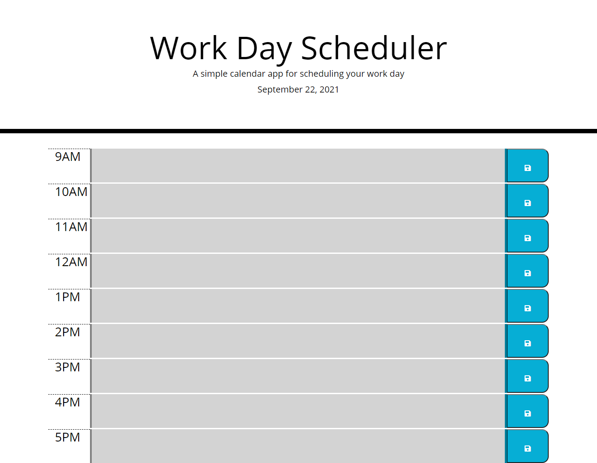

# # About The Project
## Description
this is a daily planner webiste.

The planner is layed out in daily business hours. It displays the current day at
the top of the page. It has hours listed on the 
left side of the page, events that can be clicked and changed in the middle of
the page and save buttons for the events on the  right side.
 
It is an easy and intuitive system that you can use to set up your daily work
life or maybe you are a person who loves to origize  your day routine.
 
This page uses the local storage in Google Chrome to store what you input for events. The
info that you input for the events is then stored  in local storage and saved.
When the page is refreshed or closed and reopened it will load the saved events.

### Built with
* Html
* Css
* Javascript
* Web API's
    * [BootStrap](https://getbootstrap.com/)
    * [Jquery](https://jquery.com/)
    * [Luxon](https://moment.github.io/luxon/#/)
    * [Google Fonts](https://developers.google.com/fonts)

## GitHub Page and repository
* [Github Page](https://mjbc53.github.io/daily-scheduler/)
* [Github Repo](https://github.com/mjbc53/daily-scheduler)

## Page screenshots

## Contact
* Email: mjbc53@gmail.com
* Github: [mjbc53](https://github.com/mjbc53)
